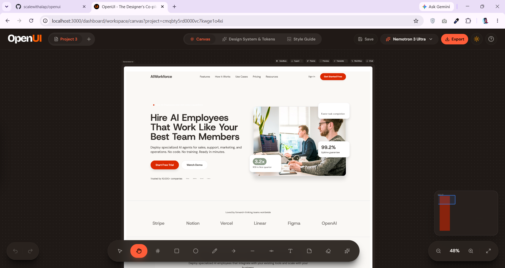
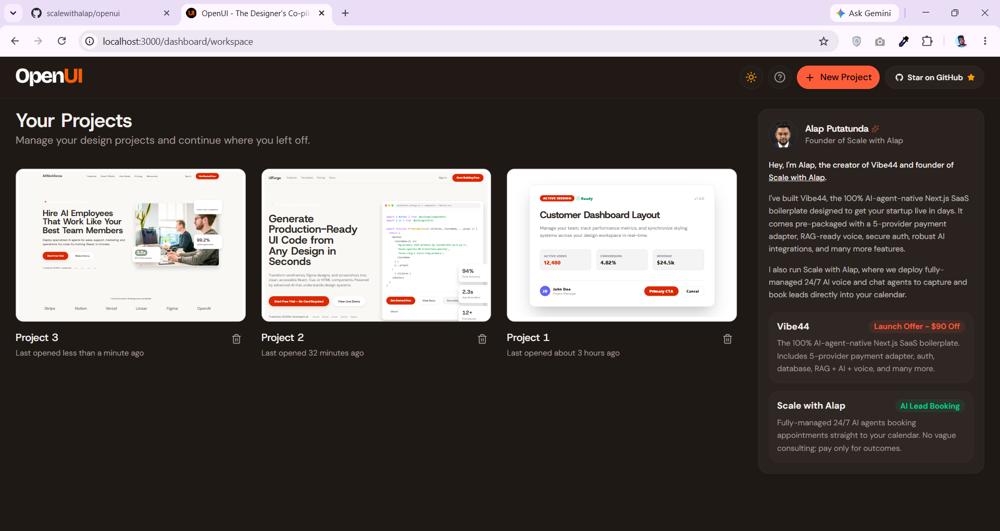
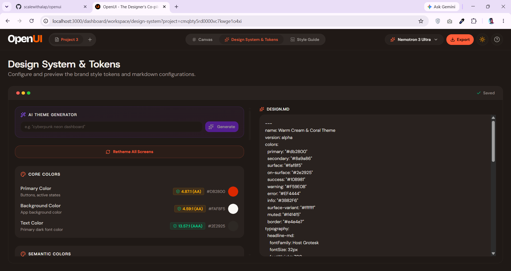
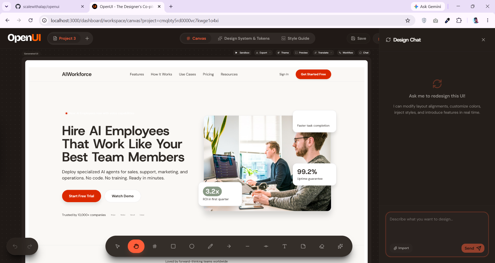
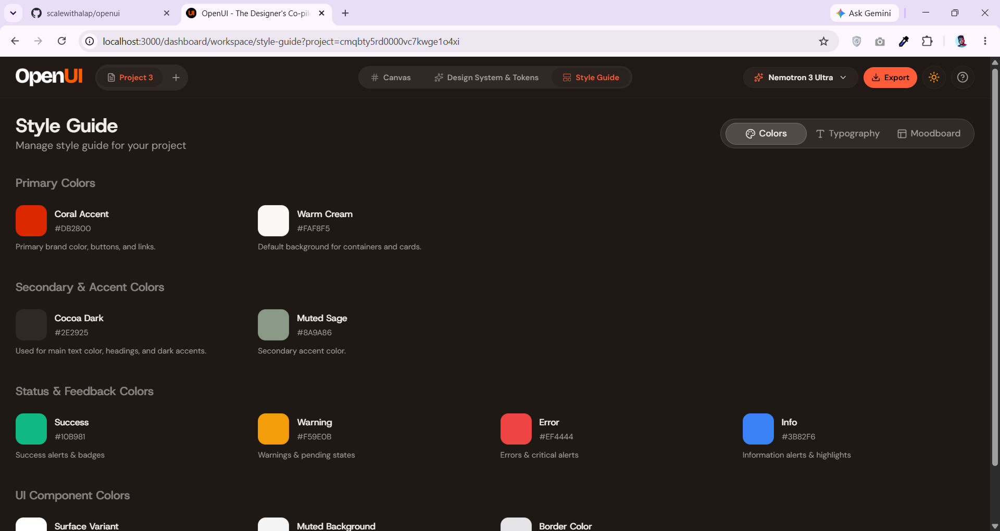
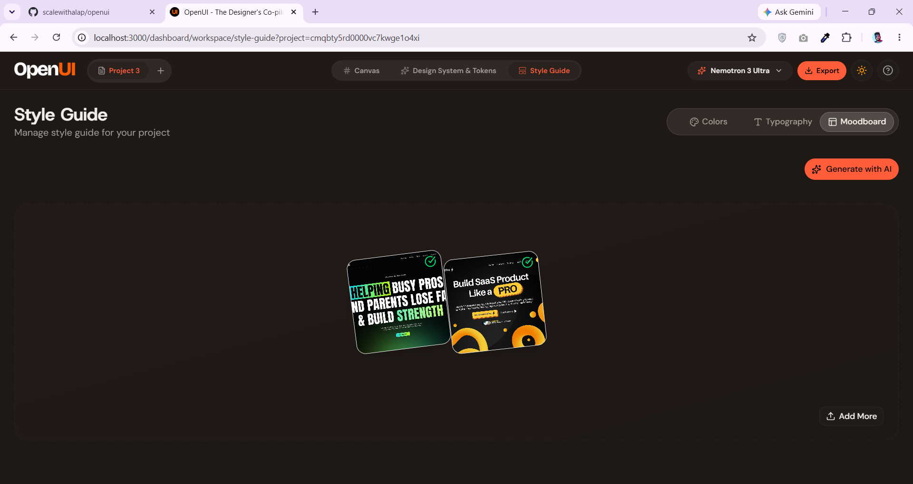
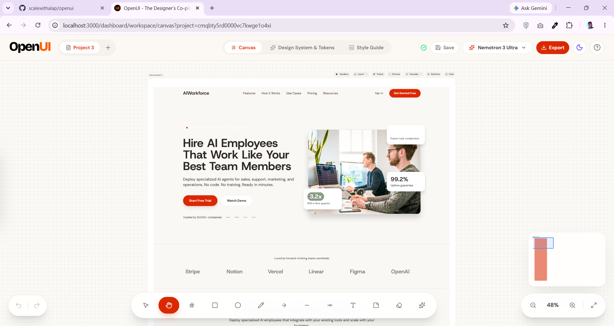
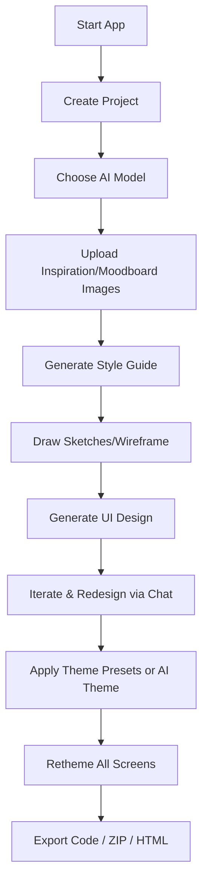

<p align="center">
  
</p>

# OpenUI — Local-First, Provider-Agnostic UI Design Platform. The Open-source Google Stitch Alternative.

[](https://opensource.org/licenses/MIT) [](https://nextjs.org/) [](https://react.dev/) [](https://www.prisma.io/) [](https://tailwindcss.com/)

OpenUI is a **free, open-source, local-first, provider-agnostic** UI design and prototyping platform. It empowers designers and developers to create stunning, accessible, enterprise-grade user interfaces entirely on their own machines using any major AI model provider.

> [!NOTE]
> **No cloud database dependencies, no subscriptions, no credit limits, and no user authentication.** Just clone, configure your local environment, and start designing without limitations.

---

## 🖼️ Previews & Demos

### ⚡ Interactive Canvas Workspace



### 🎥 Video Walkthrough of a Generated Demo

The below landing page shown in this video was built by NVIDIA Nemtron 3 Ultra (OpenRouter) with this prompt only:
"A premium landing page for a platform offering AI-employees to businesses." **Click on the image below to download the demo video.**

[](https://raw.githubusercontent.com/scalewithalap/openui/main/public/demo-video.mp4)

### 🎨 Dashboard Workspace & Chat with Your Generated UI Designs

<div align="center">
  
  
</div>

### 🧩 Additional Features & Capabilities. There are many more...

_Live Design System Editor & DESIGN.md file support. And, Complete Style Guide with Colors & Typography_

<div align="center">
  
  
</div>

_Generate Colors & Typography with AI from Images via Moodboard & Light Mode Support_

<div align="center">
  
  
</div>

---

## 🚀 Key Architectural Pillars

- 💾 **Local-First Storage**: Powered by **SQLite** and **Prisma ORM**. All project files, generated HTML/react components, style guides, and design uploads are stored strictly on your local disk (`data/openui.db`).
- 🔌 **Provider-Agnostic Pipeline**: Call models from **OpenRouter, NVIDIA NIM, local Ollama, Anthropic, OpenAI, or Google AI Studio** using a single unified interface. Enable only the ones you want.
- 🔍 **Searchable Model Registry**: Easily select default models per project, search/filter model lists in real time, and override model selections dynamically for individual chat redesign inputs.
- 🖼️ **Local File Assets**: All moodboard and inspiration images are written locally to the filesystem and served via secure local static endpoints.

---

## ⚡ Ship Your Next AI SaaS in a Weekend with Vibe44

Looking to build your own high-performance, production-ready AI SaaS or application like OpenUI? Check out **[Vibe44](https://vibe44.com)**, the **best AI-agent-native Next.js SaaS boilerplate**.

Vibe44 handles all the heavy lifting—database integrations, styling configuration, streaming APIs, and asset hosting—so you can launch your next AI product in record time. Learn more and get started at **[vibe44.com
](https://vibe44.com)**

---

## OpenUI Features Overview

### 🎨 1. Core Generation & Customization

- **AI UI Generation**: Generate Tailwind CSS HTML from text prompts with streaming real-time preview.
- **Style Word Bank**: Curated vocabulary of visual style presets (Atmosphere, Layout, Texture, Color) from a dropdown picker.
- **Reference Image Attachment**: Integrate local reference/inspiration moodboard images directly into prompt contexts.
- **Edit Theme Popover**: Instantly control design aesthetics per shape.
  - **Light/Dark Toggle**: Swap between modes seamlessly.
  - **Accent Presets**: 8 curated color highlights (Coral, Amber, Rose, Blue, Emerald, Violet, Cyan, Fuchsia).
  - **Corner Radius Presets**: 4 rounding levels (Sharp, Soft, Round, Full).
  - **Font Pairs**: 8 harmonious font pairings (Minimal, Modern, Elegant, Friendly, Technical, Creative, Classic, Bold).

### 🎯 2. Type-Safe Design System & Expanded Token Model

- **Strong-Typed `ExtendedStyleGuide`**: Dynamic `colorSections[]` and `typographySections[]` with Zod-validated schemas.
- **Expanded Token Model**: 11 semantic color tokens, 4 elevation levels, border width, overlay opacity — all stored in YAML frontmatter.
- **WCAG Contrast Checker**: Real-time AA/AAA contrast ratio badges for text-on-background combinations.
- **Bidirectional DESIGN.md Sync**: Edit visual controls or raw markdown — changes sync both ways via `parseMarkdownToGuide` / `generateMarkdownFromGuide`.
- **DESIGN.md Export/Import**: Export token state as standardized markdown, import it back to synchronize styling.

### 🔴 3. Live Token Injection & Preview

- **Real-Time CSS Variable Broadcasting**: Design token changes propagate instantly to all canvas iframes via `postMessage`.
- **Token Sync Tracking**: Each generated UI shape tracks a `tokenHash` — a swatch strip shows sync status (✓ in sync / ⚠ tokens changed).
- **Fullscreen Interactive Preview**: Token injection works in fullscreen mode with device viewport simulation (Mobile, Tablet, Desktop).

### ✨ 4. AI-Powered Theme Features

- **AI Theme Generator**: Type a description (e.g., "cyberpunk neon dashboard") and generate a complete design system via AI with structured Zod-validated output.
- **10 Curated Theme Presets**: One-click application of complete themes — Midnight Blue, Forest, Sunset Warm, Corporate, Glassmorphism, Neon Pop, Pastel Dream, Earth Tone, Arctic, Monochrome.
- **Retheme All Screens**: Apply updated design tokens to every generated UI screen at once with streaming progress indicator.
- **Moodboard Color Extraction**: k-means clustering extracts dominant colors from uploaded moodboard images and maps them to design token roles.

### 🗺️ 5. Canvas Enhancements

- **Canvas Minimap**: Proportional shape overview in the bottom-right corner with click-to-navigate and viewport indicator.
- **Grid Snapping**: Snap shape positions to 20/40/60px grids during drag operations.
- **Alignment Guides**: Automatic edge/center alignment detection against other shapes with 6px threshold.
- **Infinite Canvas**: Pan, zoom (0.1x–8x), with radial dot grid background.

### 📋 6. Version History

- **Style Guide Snapshots**: Save, restore, delete, and rename up to 20 named snapshots of your design token state.
- **Auto-Snapshot**: Snapshots captured before major token changes for easy rollback.

### 🔀 7. Design Variants & Prototypes

- **Parallel Variant Generation**: Generate up to 5 parallel visual variations of a prompt simultaneously.
- **Creative Range Control**: Adjust creative freedom (Refined vs. Creative) using temperature/aesthetic system prompt overrides.
- **Side-by-Side Variant Comparison**: Evaluate sibling variants in synchronized iframe views, pick winners, and prune candidates.

### 📱 8. Device Layout Translation

- **Device Viewport Simulation**: Simulates rendering viewports (Mobile, Tablet, Desktop) in real-time.
- **Layout Translation**: Automatically translates layouts (e.g. Mobile vertical stacked → Desktop multi-column) via AI prompts.

### 📦 9. Code Export Pipeline

- **Framework Code Conversion**: Convert generated HTML+Tailwind CSS into production-ready **React**, **Vue 3 SFC**, standalone **Angular**, or reactive **Svelte** components with streaming preview.
- **ZIP Export**: Package multiple generated screen layouts as standalone HTML files inside a single ZIP download.
- **HTML Download**: Export individual screens as standalone HTML files.

### 🔄 10. Multi-Screen Workflows

- **Workflow Generation**: Generate connected multi-screen application flows from a single prompt.
- **Workflow Redesign**: Iterate on individual screens within a workflow while maintaining flow consistency.

---

## 🛠️ Step-by-Step Installation

Follow these steps to set up and run OpenUI on your machine:

### 1. Clone the Repository

```bash
git clone https://github.com/scalewithalap/openui.git
cd openui
```

### 2. Configure Environment Variables

Copy the template configuration file to create your local environment:

```bash
cp .env.example .env.local
```

Open `.env.local` in your editor and add the API keys for the providers you want to enable.

> [!TIP]
> Providers with valid API keys configured will automatically be detected and listed in the model selector dropdown in the workspace UI.

### 3. Install Dependencies

Install all packages:

```bash
npm install
```

### 4. Setup the Database

Initialize and migrate the local SQLite database, then generate the Prisma client types:

```bash
npm run setup
```

This command creates the SQLite database file at `data/openui.db` and generates the types in your `node_modules` directory.

### 5. Start the Application

Boot up the Next.js development server:

```bash
npm run dev
```

Open **[http://localhost:3000](http://localhost:3000)** in your browser to start creating!

---

## 🔌 AI Provider Configuration

Enable one or more AI providers in your `.env.local` to power the UI generator pipeline:

| Provider            | Env Variable          | Get Started / API Key Links                                 |
| :------------------ | :-------------------- | :---------------------------------------------------------- |
| 🌐**OpenRouter**    | `OPENROUTER_API_KEY`  | [openrouter.ai/keys](https://openrouter.ai/keys)            |
| 🟢**NVIDIA NIM**    | `NVIDIA_NIM_API_KEY`  | [build.nvidia.com](https://build.nvidia.com/)               |
| 🦙**Ollama**        | `OLLAMA_ENABLED=true` | [ollama.com](https://ollama.com/) (Run locally)             |
| 🛡️**Anthropic**     | `ANTHROPIC_API_KEY`   | [console.anthropic.com](https://console.anthropic.com/)     |
| 🧠**OpenAI**        | `OPENAI_API_KEY`      | [platform.openai.com](https://platform.openai.com/api-keys) |
| ♊**Google Gemini** | `GEMINI_API_KEY`      | [aistudio.google.com](https://aistudio.google.com/)         |

### Running with Local Ollama (100% Offline Generation)

If you want to run completely offline without external API keys:

1. Download and run Ollama from [ollama.com](https://ollama.com).
2. Pull a vision/multimodal model (e.g., `ollama pull llava` or `ollama pull minicpm-v`).
3. Set the following in `.env.local`:
   ```env
   OLLAMA_ENABLED=true
   OLLAMA_BASE_URL=http://localhost:11434
   ```
4. Start Ollama locally. The UI will automatically pull and display your downloaded Ollama models in the workspace dropdown.

---

## 🎨 Creative Workflow



1. **Create a Project**: Head to the dashboard and create a new canvas.
2. **Select a Model**: Use the searchable dropdown in the top bar to choose your primary generation model.
3. **Upload Moodboard Assets**: Drag-and-drop reference UIs or wireframes into the sidebar.
4. **Draft a Wireframe**: Sketch layout components, shapes, and text blocks on the canvas.
5. **Generate & Refine**: Click **Generate** to stream real-time Tailwind-styled UI code. Iterate by typing instructions in the redesign chat box.
6. **Theme & Export**: Apply presets, generate AI themes, retheme all screens, then export to React/Vue/Angular/Svelte or download as ZIP.

---

## 📁 Repository Directory Map

- `prisma/` — Data schema file (`schema.prisma`) and local migrations history.
- `app/api/` — Serverless API endpoints (generate, redesign, theme, retheme, convert, workflow, style).
- `components/canvas/` — Core interactive canvas: shapes, selection, minimap, toolbars.
- `components/canvas/shapes/generatedui/` — Generated UI shape: preview, chat, code conversion, design tokens editor, theme popover, fullscreen preview.
- `redux/slice/` — State management: shapes (EntityAdapter), style-guide (tokens + snapshots), viewport (pan/zoom).
- `hooks/` — Custom hooks: canvas interactions, token injection, snap grid, moodboard styles.
- `lib/ai/` — Model registry mapping and dynamic model list aggregators.
- `lib/db/` — Database helpers managing projects, image uploads, and settings.
- `lib/` — Utilities: contrast checker, color extraction, theme presets, frame snapshot, ZIP export.
- `.agents/skills/` — Modular AI agent skill files for complex subsystems.
- `data/` — Ignored directory housing `openui.db` and the `uploads/` assets folder.

---

## 📜 Commands Reference

- `npm run dev` — Starts the development server using Turbopack.
- `npm run build` — Compiles and builds the production Next.js application.
- `npm run setup` — Automatically runs Prisma migrations and generates the Prisma client.
- `npm run db:migrate` — Creates and applies schema changes to your local database.
- `npm run db:reset` — Resets your local database tables to a clean slate.

---

## 🤖 For AI Agents

If you are an AI agent working on this codebase, read these files first:

- `AGENTS.md` — Operational rules, workspace mapping, and MCP server usage.
- `CLAUDE.md` — Claude Code-specific onboarding guide.
- `DESIGN.md` — Design system specifications, YAML schema, and workspace theming.
- `.agents/skills/` — Modular skill files for canvas, redux, design system, and API routes.
- `.agents/rules/system-prompt.md` — System prompt with pre-flight checklist.

---

## 👤 Creator & Author

OpenUI is created and maintained by **[Alap Putatunda](https://scalewithalap.com)** (Founder of **Scale with Alap**).

> Hey, I'm Alap — creator of **[Vibe44](https://vibe44.com)** (the best AI-agent-native Next.js SaaS boilerplate) and founder of **[Scale with Alap](https://scalewithalap.com)**. I run one fully-managed system for high-ticket local service businesses: a 24/7 AI agent that captures, qualifies, and books every inbound lead — across phone, SMS, web, chat, WhatsApp, social DMs, Google, and email — straight into your calendar.
>
> I make sure not a single lead you've already paid for is ever missed, ignored, or left un-booked — the last mile where most local businesses quietly lose 20–40% of their revenue.
>
> And you only pay for the outcome: booked appointments, not voice minutes or messages. Stop paying for open-ended consulting or AI tools you have to run yourself. Every engagement ships with a fixed scope, fast setup, and the one KPI that actually matters — appointments on your calendar — backed by a 14-day performance pilot. No vague experimentation. Just a production-ready system that runs itself.

Learn more about the agency at **[scalewithalap.com](https://scalewithalap.com)** and check out the production-grade Next.js boilerplate at **[vibe44.com](https://vibe44.com)**!

---

## 📄 License

OpenUI is licensed under the **MIT License**. Feel free to fork, customize, distribute, and build upon this platform without restrictions!
